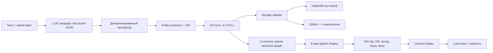

# GraphRAG, гиперграфовая память и «зажигание»: исследование для задачи хакатона

**Дата исследования:** 23 июля 2026  
**Охват:** 30+ первичных и технических источников, включая *Essential GraphRAG*, Microsoft GraphRAG, HyperGraphRAG, HippoRAG, Graphiti/Zep, Qdrant, Neo4j и FalkorDB.

## Краткий вывод

Задача хакатона — не «сделать GraphRAG». Требуется собственный нейросимвольный агент с канонической ассоциативно-гетерогенной памятью, точной моделью `<S,C,P,H,L>`, ролевыми гиперсвязями, восьмишаговым Ignition Engine, DSL, сборкой мусора и воспроизводимым UID-трейсом рассуждения. Обычный vector RAG, Microsoft GraphRAG или готовый GraphRAG SDK закрывают лишь периферию: извлечение кандидатов, хранение, поиск, provenance и отдельные идеи обхода графа.

Наиболее надёжная архитектура: независимое типизированное AH-ядро на Python, хранение как сменный адаптер и отдельный быстрый in-memory слой для тиков активации. Факт или событие следует реифицировать как узел-гиперребро с ролевыми связями `SUBJECT`, `OBJECT`, `LOCATION`, `TIME`, `CAUSE`, `INSTRUMENT`. LLM предлагает строгое JSON-представление, но все инварианты, UID, слияние сущностей и запись выполняются детерминированным валидатором через DSL.

Для прототипа FalkorDB интересен как единое graph/vector/full-text хранилище и благодаря GraphBLAS-представлению. Neo4j + Qdrant лучше документирован и удобен для гибридного retrieval, но сложнее синхронизируется. Ни один вариант не заменяет AH-ядро и точный алгоритм зажигания.

---

## 1. Что в действительности требуется построить

По условиям задачи продукт состоит из четырёх связанных, но разных контуров:

1. **Семантический парсер.** LLM преобразует текст в предикаты и актантные роли.
2. **AH-память.** Знание хранится в точной типизированной структуре `<S,C,P,H,L>`, а не только в чанках и эмбеддингах.
3. **Исполняемый DSL.** Все операции построения, поиска, композиции и изменения памяти имеют проверяемую семантику.
4. **Ignition Engine.** Активация распространяется по памяти дискретными тиками с обновлением весов, глобальным «зажиганием», забыванием и наблюдаемым UID-трейсом.

Это принципиально шире Retrieval-Augmented Generation. RAG отвечает на вопрос «какие фрагменты текста положить в контекст модели». Задача хакатона дополнительно спрашивает: «как выразить многоместный факт, как связать его с другими фактами, как распространять активацию, как обучать веса, как удалить действительно мёртвые элементы и как доказать путь вывода».

Даже Microsoft GraphRAG строит главным образом граф сущностей и отношений, обнаруживает сообщества, генерирует их резюме и предоставляет local/global/DRIFT-поиск. Это сильный способ извлечения контекста, но не реализация заданной AH-алгебры и не восьмишаговый tick-engine ([методы Microsoft GraphRAG](https://microsoft.github.io/graphrag/index/methods/), [обзор запросов](https://microsoft.github.io/graphrag/query/overview/)).

### Hard constraints, которые нельзя потерять

- Корпус не меньше 15 тысяч слов.
- Не меньше 1000 узлов и связей.
- Не меньше 150 символов первого порядка с заданным отношением `R`.
- Для Middle: шесть ролей и восемь шаблонов; автоматическое извлечение; role F1 не ниже 0,6.
- Для Senior: точные функции `f/g/t/h/ν`, GC, полный DSL, устойчивые циклы активации и объяснимый путь не короче трёх переходов.
- Один тик — не более 500 мс на референсном железе.
- На защите: невиданный факт должен автоматически попасть в память с UID, а новый вопрос — породить по-тиковый UID-трейс.

Следствие: vector RAG можно и нужно оставить как baseline и как механизм начального посева, но нельзя выдавать его за решение.

## 2. Где здесь полезен GraphRAG

GraphRAG полезен в четырёх местах:

- извлечение сущностей, отношений и утверждений из текста;
- разрешение сущностей и дедупликация;
- поиск начальных узлов по запросу;
- сбор контекста и provenance для финального ответа.

В оригинальной работе Microsoft GraphRAG граф сущностей сочетается с иерархическими резюме сообществ, что улучшает «глобальные» вопросы по большим корпусам по сравнению с обычным RAG в исследованной авторами конфигурации ([Edge et al., 2024](https://arxiv.org/abs/2404.16130)). Local search объединяет совпавшие сущности, соседние отношения и исходные текстовые фрагменты; global search выполняет map-reduce по community reports; DRIFT комбинирует глобальную и локальную стратегии ([документация запросов](https://microsoft.github.io/graphrag/query/overview/)).

Для хакатона это даёт хорошие референсные паттерны:

- хранить происхождение каждого факта до чанка и текстового span;
- отделять построение графа от поисковой стратегии;
- использовать локальный и глобальный контекст по-разному;
- иметь простой vector RAG как контрольную группу.

Но готовый Microsoft GraphRAG неудобен как ядро. Его стандартный pipeline извлекает сущности, отношения, claims и community summaries; FastGraphRAG использует более дешёвые NLP/co-occurrence-процедуры, но документация предупреждает о более шумном графе ([методы индексирования](https://microsoft.github.io/graphrag/index/methods/)). Репозиторий также прямо позиционируется как методология/демонстрация, предупреждает о высокой стоимости индексирования и необходимости prompt tuning ([Microsoft GraphRAG repository](https://github.com/microsoft/graphrag)). В исходной документации проекта извлечение графа оценивается примерно в 75% стоимости стандартного индексирования, поэтому слепо прогонять pipeline на каждой итерации неразумно ([methods.md](https://github.com/microsoft/graphrag/blob/main/docs/index/methods.md)).

Наконец, GraphRAG не гарантированно превосходит vector RAG. Систематический обзор показывает типичную картину: обычный RAG силён на детальных и одношаговых вопросах, GraphRAG — на части многопереходных задач, а гибриды дают лучший охват ценой сложности ([Han et al., 2025](https://arxiv.org/abs/2502.11371)). Бенчмарк GraphRAG-Bench также сообщает, что многие графовые реализации проигрывают vanilla RAG на отдельных классах задач; поэтому оценку надо стратифицировать по типу вопроса, а не усреднять всё в одно число ([GraphRAG-Bench](https://github.com/GraphRAG-Bench/GraphRAG-Benchmark)).

## 3. Что полезного в переданных материалах

### 3.1. *Essential GraphRAG*

Книга Томажа Братанича и Оскара Хане полезна как инженерный учебник, особенно главы о text-to-Cypher, построении графа из текста, Microsoft GraphRAG и оценке. В книге показаны:

- передача схемы графа в prompt;
- few-shot примеры и словарь соответствия пользовательских терминов схеме;
- schema-constrained/structured output;
- unique constraints и индексы;
- entity resolution;
- связь фактов с исходными фрагментами;
- semantic chunking, community detection, local/global search;
- раздельная оценка correctness, context recall и faithfulness.

Сопроводительный код книги доступен в [репозитории авторов](https://github.com/tomasonjo/kg-rag), а официальная страница — у [Manning](https://www.manning.com/books/essential-graphrag). Эти паттерны стоит использовать в parser/evaluation контурах.

Однако схема книги в основном property-graph и retrieval-ориентирована. Она не задаёт точную структуру `<S,C,P,H,L>`, не реализует многоместные актантные гиперсвязи, функции тика, GC или предметный DSL. То есть это материал для двух-трёх подсистем, а не готовая архитектура хакатонного агента.

### 3.2. Qdrant + Neo4j

Переданный пример Qdrant показывает двухступенчатый GraphRAG: семантический поиск в Qdrant даёт seed-сущности, затем Neo4j расширяет их графовыми связями ([GraphRAG with Qdrant and Neo4j](https://qdrant.tech/documentation/examples/graphrag-qdrant-neo4j/)). Для проекта это полезная основа retrieval:

1. dense/sparse запрос находит кандидатов;
2. payload-фильтры ограничивают тип, роль, эпизод или временной интервал;
3. графовый обход достраивает объяснимый контекст;
4. текстовые evidence-чанки поступают LLM.

Qdrant поддерживает многостадийные запросы, dense+sparse fusion и RRF/DBSF ([Hybrid and Multi-Stage Queries](https://qdrant.tech/documentation/search/hybrid-queries/)). Payload и payload indexes позволяют фильтровать по структурным полям до/во время поиска ([payload](https://qdrant.tech/documentation/concepts/payload/), [filtering](https://qdrant.tech/documentation/search/filtering/)). Практическая схема: `point.id == AH.uid`, а в payload лежат `element_type`, `role`, `episode_uid`, `source_uid`, `valid_from`, `valid_to`, `confidence`.

Neo4j не имеет нативного гиперребра. Официальная документация рекомендует моделировать отношения с дополнительной структурой через промежуточный узел ([modeling designs](https://neo4j.com/docs/getting-started/data-modeling/modeling-designs/)). Для AH это не компромисс, а естественная реификация: многоместное событие становится узлом, а его участники присоединяются ролевыми incidence-связями.

Neo4j GDS содержит PageRank/Personalized PageRank с весами, направлением, source nodes и критериями сходимости ([PageRank](https://neo4j.com/docs/graph-data-science/current/algorithms/page-rank/)). Его можно использовать как baseline spreading activation, но нельзя подменять им заданные функции `f/g/t/h/ν` и восемь шагов тика.

Главный минус пары — операционная сложность. UID, версии, удаление и транзакции приходится синхронизировать между двумя системами. Сам тик всё равно лучше считать в памяти, иначе сетевые round trips и запросы к БД начнут конкурировать с лимитом 500 мс.

### 3.3. FalkorDB

FalkorDB — property-graph СУБД с openCypher-подобным языком, full-text и vector indexes. Граф хранится в разреженных матрицах, а обходы реализуются через GraphBLAS, что концептуально хорошо совпадает с распространением активации ([архитектура FalkorDB](https://docs.falkordb.com/design/), [репозиторий](https://github.com/FalkorDB/FalkorDB)).

GraphRAG SDK FalkorDB уже предоставляет:

- schema-guided извлечение;
- vector/full-text/Cypher retrieval;
- graph expansion;
- provenance/citations;
- incremental updates.

Это описано в [документации GraphRAG SDK](https://docs.falkordb.com/genai-tools/graphrag-sdk). Векторный индекс построен на HNSW и может создаваться для свойств узлов и отношений ([vector index](https://docs.falkordb.com/cypher/indexing/vector-index.html)).

Преимущество для хакатона — один сервис вместо Qdrant + Neo4j и потенциально удобные матричные операции. Но готовый SDK остаётся generic GraphRAG: точные типы AH, ролевые гиперузлы, по-тиковое состояние, GC и DSL всё равно нужно писать. Заявления о производительности на [странице benchmark](https://benchmark.falkordb.com/) являются vendor-run результатами; их нельзя переносить на референсное железо без собственного измерения. Ещё одно практическое ограничение — сервер распространяется под SSPLv1, что надо проверить на совместимость с форматом сдачи.

**Предварительный выбор:** FalkorDB — лучший кандидат для быстрого single-store прототипа; Neo4j + Qdrant — лучший кандидат, если важнее зрелая документация, гибридный поиск и привычный tooling. В обоих случаях ядро должно оставаться независимым от БД.

## 4. Наиболее близкие научные линии

### 4.1. HyperGraphRAG: факты как n-ary отношения

Обычный knowledge graph сводит факты к парам `subject–relation–object`. Это плохо выражает событие вроде:

> «Сервис A упал в Москве во вторник из-за исчерпания пула соединений после релиза B».

Здесь одновременно важны субъект, место, время, причина, инструмент/условие и предикат. Разложение на независимые пары теряет принадлежность аргументов одному факту.

HyperGraphRAG напрямую моделирует n-ary факт как гиперребро. Для реализации в обычной графовой БД авторы используют двудольное представление: entity nodes и hyperedge nodes; векторный поиск возможен по обоим типам, а расширение идёт `entity → hyperedge → entities` ([HyperGraphRAG, NeurIPS 2025](https://arxiv.org/abs/2503.21322), [полный текст](https://ar5iv.labs.arxiv.org/html/2503.21322v3)). Это почти точное техническое соответствие ролевому `N`-гиперузлу, требуемому в задаче.

В экспериментах авторов HyperGraphRAG показал более высокие retrieval-метрики, чем LightRAG и Microsoft GraphRAG на выбранных наборах. Но в той же работе построение занимало 366,52 секунды на 10 тысяч токенов, а запрос — 9,546 секунды в их конфигурации. Эти числа нельзя обобщать, однако они показывают, что исследовательский pipeline нельзя переносить как есть под тик в 500 мс.

Более новый HyperRAG строит n-ary гиперграф и извлекает query-conditioned интерпретируемые цепочки; авторы сообщают средний прирост 2,95% MRR и 1,23 пункта Hits@10 над сильнейшим baseline в их экспериментах ([HyperRAG, WWW 2026](https://arxiv.org/abs/2602.14470)). Для проекта ценна не конкретная цифра, а подтверждение направления: ролевой гиперграф помогает там, где ответ зависит от совместного контекста нескольких сущностей.

### 4.2. HippoRAG и spreading activation

HippoRAG строит OpenIE-граф и запускает Personalized PageRank от сущностей запроса, стремясь получить многопереходный retrieval без многократных LLM-вызовов. В исходной работе авторы сообщают до 20% улучшения retrieval и более низкую стоимость/задержку по сравнению с iterative IRCoT в их setup ([HippoRAG, NeurIPS 2024](https://papers.neurips.cc/paper_files/paper/2024/file/6ddc001d07ca4f319af96a3024f6dbd1-Paper-Conference.pdf)).

Особенно полезен их error analysis: около 48% рассмотренных ошибок связывались с NER, 28% — с отсутствующим или неверным OpenIE-отношением, 24% — с ранжированием PPR. Иными словами, главный риск находится до распространения активации. Изящный tick-engine не восстановит факт, который LLM неверно разобрала или не связала с существующей сущностью.

SA-RAG использует spreading activation по гетерогенному документному графу и избегает LLM-управляемого обхода. Авторы сообщают до 39 процентных пунктов прироста answer correctness над naive RAG при сочетании с iterative CoT на своих конфигурациях ([SA-RAG](https://arxiv.org/abs/2512.15922)). Это прямой концептуальный референс, но опять же не замена нормативному восьмишаговому алгоритму хакатона.

### 4.3. Global Workspace Theory как инженерная метафора

Работа *Global Workspace Theory and Deep Learning* описывает специализированные модули, ограниченную общую рабочую область и широковещательную передачу выбранного содержимого. «Ignition» связывается с резким глобальным усилением через рекуррентные взаимодействия ([GWT and Deep Learning](https://arxiv.org/abs/2012.10390)).

Для системы это даёт понятную интерпретацию:

- локальные модули предлагают кандидатов;
- конкуренция и порог выбирают содержимое workspace;
- выбранный набор получает глобальную рассылку;
- обратные связи меняют последующую динамику.

Но это следует подавать как вычислительную архитектуру, а не как заявление о сознании агента.

### 4.4. Эпизодическая и временная память

Graphiti строит динамический temporal knowledge graph: факты имеют интервалы валидности, связаны с эпизодами и обновляются инкрементально. Поиск комбинирует semantic, keyword и graph traversal; пользователь может задавать типы через Pydantic ([Graphiti](https://github.com/getzep/graphiti)).

Технический отчёт Zep различает:

- **valid time** — когда факт был истинным в предметном мире;
- **transaction time** — когда система его узнала/записала.

Отчёт также описывает provenance до эпизода, временную invalidation и использование заранее заданных Cypher-операций вместо свободно сгенерированных LLM-запросов ([Zep technical paper](https://blog.getzep.com/content/files/2025/01/ZEP__USING_KNOWLEDGE_GRAPHS_TO_POWER_LLM_AGENT_MEMORY_2025011700.pdf)).

Это хорошие шаблоны для `FOLLOW`, `CAUSE`, истории изменений и доказательства источника. Но Graphiti в основном хранит парные факты; ролевую n-ary семантику и точные AH-инварианты надо добавить самостоятельно.

### 4.5. Извлечение ролей

Semantic Role Labeling рассматривает предложение как предикат и набор аргументов. В PropBank-подобной схеме `ARG0` обычно соответствует proto-agent, `ARG1` — proto-patient, а adjuncts включают location/time. Исследования cross-domain SRL показывают, что определение границ аргументов переносится между доменами лучше, чем точная классификация роли ([Pradhan et al., 2008](https://aclweb.org/anthology/J/J08/J08-2006.pdf)).

Для задачи нужен явный mapping:

| Внутренняя роль | Типичные SRL-сигналы | Что проверять отдельно |
|---|---|---|
| `SUBJECT` | ARG0 / agent | пассив, нулевой субъект, коференция |
| `OBJECT` | ARG1 / patient/theme | несколько объектов, вложенные события |
| `LOCATION` | ARGM-LOC | место события против места сущности |
| `TIME` | ARGM-TMP | относительное время, диапазоны |
| `CAUSE` | ARGM-CAU, причинные конструкции | причина против корреляции |
| `INSTRUMENT` | ARGM-MNR/инструментальные конструкции | инструмент против способа |

LLMStructBench показывает, что структурная валидность ответа и семантическая правильность — разные величины: модель может безупречно заполнить JSON неправильными значениями. Prompt strategy иногда влияет сильнее размера модели, а constrained output прежде всего улучшает parseability ([LLMStructBench](https://arxiv.org/abs/2602.14743)). Поэтому M1 нельзя сводить к доле валидного JSON.

## 5. Рекомендуемая архитектура



### 5.1. Каноническое AH-ядро

Канонической истиной должен быть типизированный доменный слой, а не конкретные labels/edges базы. Минимальный набор сущностей:

```text
Symbol(uid, kind, canonical_name, aliases, embedding_ref, ...)
Category(uid, ...)
Predicate(uid, arity, allowed_roles, ...)
Hypernode(uid, predicate_uid, episode_uid, confidence, ...)
Actant(uid, hypernode_uid, role, target_uid, ordinal, ...)
Link(uid, source_uid, target_uid, type, weight, ...)
Episode(uid, source_uid, valid_from, valid_to, transaction_time, ...)
Evidence(uid, document_uid, chunk_uid, char_start, char_end, text_hash, ...)
ActivationState(uid, tick, pre, post, ignited, ...)
```

Типы и допустимые переходы должны следовать монографии/эталонному описанию задачи. База данных — только проекция этой модели. Это позволяет заменить Neo4j на FalkorDB без переписывания семантики и тестировать инварианты без запущенного сервера.

### 5.2. Реифицированный факт

Пример:

> «Релиз B вызвал отказ сервиса A во вторник в Москве».

Представление:

```text
N_104 --PREDICATE--> P_FAILURE
N_104 --ACTANT{role=SUBJECT}--> S_SERVICE_A
N_104 --ACTANT{role=CAUSE}--> N_RELEASE_B
N_104 --ACTANT{role=TIME}--> S_TUESDAY
N_104 --ACTANT{role=LOCATION}--> S_MOSCOW
N_104 --SUPPORTED_BY--> EVIDENCE_77
```

Таким образом, все аргументы принадлежат одному событию. Переход `entity → fact → entity` даёт объяснимый hop. Поле `ordinal` сохраняет порядок повторяющихся ролей. Для каждого элемента нужны UID, тип, confidence, parser/prompt version и source evidence.

### 5.3. Безопасный parser pipeline

LLM не должна писать произвольный Cypher. Надёжная цепочка:

1. Нормализация текста и выделение чанка.
2. LLM возвращает JSON по строгой Pydantic/JSON Schema.
3. Детерминированная проверка типов, ролей, cardinality и обязательных полей.
4. Проверка, что evidence span действительно существует в исходном тексте.
5. Entity resolution: exact aliases → нормализованные ключи → embedding candidates → подтверждение.
6. Проверка дубликата факта и конфликта времени.
7. Назначение UID.
8. Вызов allowlisted DSL-команд.
9. Параметризованная транзакция storage adapter.
10. Добавление/обновление in-memory индексов.

Низкая уверенность не должна приводить к молчаливой записи. Такой кандидат помещается в quarantine или сохраняется с флагом `unverified`, чтобы не загрязнить ассоциативные пути.

### 5.4. Роль vector search

Эмбеддинги нужны, но как вспомогательный индекс:

- поиск seed-символов и гиперузлов;
- entity resolution;
- семантический поиск evidence;
- vanilla RAG baseline для M4.

Они не должны быть единственным механизмом ответа и не должны скрывать происхождение пути. Каждый найденный vector point обязан разрешаться в AH UID.

## 6. Ignition Engine, GC и DSL

### 6.1. Как уложиться в 500 мс

Точный тик следует реализовать по нормативным восьми шагам задачи. Для производительности текущий рабочий подграф надо держать в памяти:

- плотные массивы activation/threshold/life;
- отображение `uid ↔ integer index`;
- CSR/CSC incidence и adjacency матрицы либо компактные списки рёбер;
- предвычисленные маски типов и ролей;
- кольцевой буфер последних tick logs.

При требуемом минимуме около тысячи элементов вычисление в памяти не должно быть узким местом. БД нужна для долговременного хранения, аналитики и восстановления, а запись событий/снапшотов может выполняться после тика или пакетно. Однако финальное утверждение о latency возможно только после benchmark на референсном железе.

Каждый тик должен порождать структурированный лог:

```json
{
  "tick": 17,
  "target_uid": "N_104",
  "activation_before": 0.31,
  "contributions": [
    {"from_uid": "S_SERVICE_A", "via_uid": "L_88", "amount": 0.22},
    {"from_uid": "N_RELEASE_B", "via_uid": "L_91", "amount": 0.14}
  ],
  "activation_after": 0.67,
  "threshold": 0.60,
  "ignited": true,
  "weight_updates": [{"link_uid": "L_88", "before": 0.50, "after": 0.52}]
}
```

Это одновременно trace для защиты, диагностика расходимости и основа M2. Финальная «цепочка рассуждения» строится не из текста LLM, а из реально сработавших UID-переходов.

### 6.2. GC

Безопасная стратегия — mark-and-sweep с временной защитой:

1. Корни: обязательные `S`, системные символы, закреплённые эпизоды, активные задачи.
2. Mark: достижимость только по допустимым живым связям.
3. Candidate: недостижимый объект с нулевым/ниже порога весом.
4. Grace period: новый элемент нельзя удалить сразу.
5. Sweep: удаление после TTL/числа тиков.
6. Audit: сохраняется tombstone с UID и причиной.

Для M3 недостаточно удалить 200 искусственных сирот. Нужно также измерить `false deletion rate` на живых контрольных объектах и проверить повторный цикл после новой инъекции.

### 6.3. DSL

DSL лучше реализовать как:

```text
text → Lark/tree-sitter parser → typed AST → semantic validator
     → allowlisted AH service → parameterized storage adapter
```

Set composition и операции над памятью выполняются над типизированными UID-наборами. DSL не должен быть тонкой обёрткой над Cypher, иначе семантика начнёт зависеть от выбранной БД, а некорректный запрос сможет обойти инварианты.

## 7. Сравнение вариантов стека

| Вариант | Сильные стороны | Риски | Вердикт |
|---|---|---|---|
| **Custom AH + FalkorDB** | Один graph/vector/full-text сервис; GraphBLAS; incremental graph | SSPLv1; vendor benchmarks; меньше независимых примеров | Лучший быстрый single-store кандидат |
| **Custom AH + Neo4j + Qdrant** | Зрелая документация; сильный hybrid retrieval; GDS; удобная визуализация | Два источника состояния; синхронизация UID/GC; больше DevOps | Самый понятный и защищаемый стек |
| **Custom AH + Neo4j без Qdrant** | Проще консистентность; native vector index доступен | Менее гибкий retrieval-контур, чем специализированный Qdrant | Хороший компромисс |
| **Microsoft GraphRAG как ядро** | Готовые local/global search и community summaries | Не AH; дорогой pipeline; нет tick/GC/DSL | Только baseline/источник идей |
| **Graphiti как ядро** | Эпизоды, bitemporal facts, provenance, incremental update | Парные факты; другая семантика памяти | Брать temporal-паттерны, не ядро |
| **Только vector RAG** | Быстро, просто, сильный single-hop baseline | Не выполняет ключевые требования | Только M4 baseline |

### Рекомендуемый практический выбор

Если команда уже знает Neo4j/Qdrant — не менять стек ради теоретической скорости. Реализовать AH-ядро и in-memory тик, использовать Neo4j как визуализируемую проекцию, Qdrant как seed retrieval.

Если команда начинает с нуля и готова принять лицензионное условие — проверить FalkorDB коротким spike:

- загрузить 1000–5000 элементов;
- выполнить типичные `entity → hypernode → entity` обходы;
- измерить запись, lookup, vector query;
- сравнить тик в FalkorDB и тот же тик в in-memory CSR;
- проверить backup/export и воспроизводимость Docker-сборки.

Решение о БД принять по измерению, а не по маркетинговому benchmark.

## 8. Как проектировать эксперименты M1–M5

### M1 — извлечение ролей

Сделать вручную размеченный gold set, сбалансированный по шести ролям и доменным конструкциям. Отчёт:

- precision/recall/F1 по каждой роли;
- macro-F1 и micro-F1;
- strict JSON validity;
- exact span grounding;
- доля правильных предикатов;
- entity-linking accuracy;
- confusion matrix.

Нужны шумовые варианты: пассив, перестановка частей предложения, местоимения, отрицание, несколько событий в одном предложении, относительное время, вложенная причина. Train/dev/test должны разделяться по документам, иначе соседние формулировки дадут утечку.

### M2 — многопереходный вывод

HotpotQA полезен как методический образец: вопрос сопровождается supporting facts и требует нескольких документов ([HotpotQA](https://aclanthology.org/D18-1259/)). Но для AH нужен собственный gold:

- 100+ вопросов;
- страты 1–6 hops;
- уникальная либо явно перечисленная допустимая UID-цепочка;
- distractor-узлы;
- вопросы с отсутствующим ответом.

Метрики:

- answer accuracy;
- path exact match / edge F1;
- trace completeness;
- evidence faithfulness;
- latency p50/p95;
- число тиков до ignition.

### M3 — GC

До теста зафиксировать набор живых объектов и expected roots. Инъецировать 200 сирот, ждать до 50 тиков, проверить:

- удалено сирот;
- осталось сирот;
- удалено живых элементов;
- нарушения ссылочной целостности;
- повторный прогон после добавления нового факта.

### M4 — AH против того же LLM + RAG

Контролировать:

- одинаковую LLM, temperature и системный prompt;
- один и тот же корпус и chunking;
- одинаковый лимит контекста;
- одинаковые правила оценки ответа;
- одинаковый набор вопросов.

Вопросы разделить на single-hop/detail, multi-hop, temporal/causal, global summary и unanswerable. Использовать paired comparison и bootstrap confidence intervals. Галлюцинацией считать утверждение без поддерживающего UID/evidence, а не просто несовпадение формулировки с эталоном.

Это особенно важно, потому что свежие исследования показывают сильный vector baseline и зависимость преимуществ GraphRAG от класса задачи ([UnWeaver](https://arxiv.org/abs/2603.29875), [GraphRAG-Bench](https://github.com/GraphRAG-Bench/GraphRAG-Benchmark)).

### M5 — локальная модель до 8B против коммерческой

Одинаковая JSON Schema, одинаковые примеры и одинаковое число retries. Раздельно измерять:

- schema compliance;
- semantic role F1;
- evidence grounding;
- latency;
- tokens/стоимость;
- долю кандидатов, отправленных в quarantine.

Нельзя считать автоматически исправленный JSON полноценным успехом: repair повышает parse rate, но может скрыть семантическую ошибку.

### Дополнительные метрики конструкции памяти

- duplicate entity rate;
- duplicate fact rate;
- orphan rate;
- provenance coverage;
- доля фактов с evidence span;
- нарушения типов/arity;
- циклы там, где требуется ацикличность;
- update/invalidation accuracy;
- размер памяти и tick latency по мере роста.

Обзоры RAG-оценки подтверждают, что retrieval relevance, answer correctness и faithfulness должны оцениваться раздельно; одной агрегированной метрики недостаточно ([Evaluation of RAG: A Survey](https://arxiv.org/abs/2405.07437)).

## 9. План реализации

### Этап 0. Уточнить нормативную семантику

До кодирования получить монографию или точный референс:

- определения `S,C,P,H,L`;
- все типы и инварианты;
- формулы `f/g/t/h/ν`;
- точные восемь шагов;
- полный синтаксис/семантику DSL;
- что именно считается symbol first order и отношением `R`.

### Этап 1. Executable specification

- Pydantic/dataclass-модели;
- UID policy;
- in-memory reference implementation;
- property-based tests инвариантов;
- сериализация и replay.

### Этап 2. Parser + gold set

- 50–100 вручную размеченных предложений для раннего цикла;
- schema-constrained extraction;
- deterministic validation;
- role-level error report;
- entity resolution.

### Этап 3. Хранение и provenance

- ролевые гиперузлы;
- source/episode/evidence;
- FalkorDB либо Neo4j adapter;
- Qdrant только при доказанной пользе;
- export/import и визуализация UID.

### Этап 4. Ignition + trace

- точные восемь шагов;
- in-memory sparse indices;
- structured tick logs;
- trace reconstruction;
- latency benchmark и профилирование.

### Этап 5. DSL + GC

- grammar/AST;
- allowlisted команды;
- set composition;
- mark-and-sweep с grace period;
- replayable audit.

### Этап 6. Корпус и эксперименты

Лучший домен для Senior — технические инциденты или troubleshooting corpus: в нём естественно присутствуют `CAUSE`, `FOLLOW`, время, инструменты и длинные доказуемые цепочки. Учебный курс/энциклопедия проще для Junior/Middle, но может искусственно породить многопереходные вопросы.

### Этап 7. Сценарий защиты

Одна команда должна воспроизводимо показать:

1. ingestion невиданного факта;
2. JSON-кандидат;
3. решение валидатора;
4. присвоенные UID;
5. появление гиперузла в графе;
6. новый вопрос;
7. vector seeds, если использованы;
8. каждый тик и threshold crossing;
9. итоговую цепочку из 3+ переходов;
10. evidence и финальный ответ;
11. изменение гиперпараметра и объяснимое изменение динамики.

### Минимальная конкурентоспособная конфигурация

Полезно разделить «демо, которое запускается» и «систему, которая выполняет критерии». Минимальный конкурентоспособный вариант не обязан иметь сложный frontend или универсальный ingestion. Он обязан давать воспроизводимую проверяемую цепочку.

**Обязательный вертикальный срез:**

- один предметный домен;
- один стабильный формат документов;
- шесть ролей;
- восемь требуемых шаблонов;
- 150+ first-order symbols;
- 1000+ узлов и связей;
- полный путь `text → structured candidate → validated AH mutation → ignition → answer`;
- полный DSL, но без необязательного IDE;
- один storage adapter;
- отдельный vanilla RAG baseline;
- автоматический evaluation runner;
- статичная страница или notebook для визуализации UID-трейса.

**Что можно сознательно не делать в первой версии:**

- универсальный web crawler;
- несколько графовых СУБД одновременно;
- распределённые тики;
- автоматический выбор между десятком retrieval-стратегий;
- сложную генеративную визуализацию графа;
- conversational UI;
- обучение собственной embedding-модели;
- community summaries, если они не улучшают выбранные M2/M4 вопросы.

Такое сокращение соответствует модульному выводу LEGO-GraphRAG: конструкция GraphRAG имеет несколько независимых степеней свободы — построение графа, retrieval, организация контекста и генерация — и их следует выбирать по балансу качества и стоимости, а не включать все компоненты одновременно ([LEGO-GraphRAG](https://arxiv.org/abs/2411.05844)).

### Предлагаемые модули репозитория

```text
ah/
  model.py             # S,C,P,H,L и UID-типы
  invariants.py        # проверяемые ограничения
  operations.py        # канонические изменения памяти
  serialization.py     # dump/replay
parser/
  schemas.py           # LLM structured output
  extract.py
  validate.py
  resolve.py
ignition/
  state.py             # числовые массивы
  tick.py              # восемь нормативных шагов
  trace.py
  gc.py
dsl/
  grammar.lark
  ast.py
  interpreter.py
storage/
  base.py
  falkordb.py           # либо neo4j.py
  qdrant.py             # опционально
retrieval/
  seeds.py
  expand.py
  context.py
eval/
  m1_roles.py
  m2_paths.py
  m3_gc.py
  m4_rag.py
  m5_models.py
demo/
  ingest_unseen.py
  query_trace.py
```

Разбиение сохраняет важную границу: `ignition/tick.py` импортирует доменные структуры и числовое состояние, но не вызывает LLM и в идеале не выполняет сетевые запросы. `storage/*` не определяет семантику операций. `parser/*` не может напрямую менять граф. Любой ingest проходит через `ah/operations.py`.

### Критические тесты до загрузки большого корпуса

1. **Round-trip:** AH-объект после сохранения и чтения идентичен по UID, типам, ролям и весам.
2. **Duplicate fact:** повторная подача одной фразы не создаёт второй независимый гиперузел без причины.
3. **Contradiction:** новый факт с другим временем не стирает историю, а корректно закрывает или перекрывает validity interval.
4. **Role preservation:** две сущности в одном предложении не меняются местами при пассивной конструкции.
5. **Hyperedge isolation:** актанты двух похожих событий не смешиваются.
6. **Deterministic tick:** одинаковое начальное состояние и seed дают одинаковые состояния и trace.
7. **No hidden database semantics:** reference in-memory implementation и storage-backed projection дают одинаковый логический результат.
8. **GC safety:** достижимый элемент не удаляется при нулевой текущей активации, если он остаётся частью живой структуры.
9. **Trace closure:** каждый UID в финальном объяснении существует, а каждый переход подтверждается link/hypernode UID.
10. **Unsupported answer:** если evidence отсутствует, генератор отказывается или явно маркирует недостаточность данных.

### Gate для выбора хранилища

На одних и тех же синтетических данных выполнить 30 минутный spike для каждого реального кандидата и зафиксировать:

| Проверка | Целевой результат |
|---|---|
| Upsert 1000 элементов | без потери UID и ролей |
| Повторный upsert | идемпотентен |
| Двухдольный обход | возвращает роли и provenance |
| Vector seed lookup | фильтруется по типу/эпизоду |
| Delete orphan | не оставляет dangling references |
| Export/import | сохраняет логическую идентичность |
| p95 storage lookup | не доминирует в пользовательском запросе |
| Полный in-memory tick | укладывается в 500 мс с запасом |

Если FalkorDB проходит это лучше — использовать его. Если команда быстрее и увереннее получает корректный результат на Neo4j — выигрыш предсказуемости важнее теоретически более красивой матричной архитектуры.

### Проверка жизнеспособности за первую неделю

К концу первой недели должен существовать не слайд со схемой, а маленький сквозной прототип: десять вручную заданных фактов превращаются в ролевые гиперузлы, один запрос активирует минимум три проверяемых перехода, а trace выводит вклад каждого UID по тикам. Второй обязательный сценарий — повторный ingest того же факта без дублирования. Третий — добавление противоречащего факта с сохранением времени и provenance.

Если такой срез не получается, рано подключать большой корпус, UI и community detection: проблема находится в семантическом контракте. Если получается, следующий gate — 100 размеченных предложений, role F1 и нагрузочный прогон на 1000+ элементах. Только после этого оправдано тратить время на сравнение FalkorDB с Neo4j/Qdrant и на оптимизацию prompts. Такой порядок быстро отделяет научно сложные места — роли, идентичность, динамику — от обычной интеграционной работы.

## 10. Главные риски

| Риск | Вероятность/влияние | Снижение |
|---|---|---|
| Неверное понимание монографии | Очень высокое | Сначала executable spec и conformance tests |
| LLM загрязняет память | Высокое | Schema + evidence validation + quarantine |
| Entity resolution дробит граф | Высокое | aliases, deterministic keys, embedding candidates, merge audit |
| GraphRAG выглядит как решение, но не проходит hard constraints | Очень высокое | AH core и tick trace делать до красивого UI |
| 500 мс тратятся на БД/LLM | Высокое | LLM вне тика; sparse in-memory state |
| GC удаляет полезное | Среднее/высокое | roots, grace period, tombstones, false-deletion test |
| M4 нечестно сравнивает системы | Высокое | frozen paired protocol и task strata |
| Vendor benchmark не повторяется | Среднее | локальный spike на reference-like hardware |
| Демо зависит от сети/API | Высокое | локальный replay corpus, cached embeddings, deterministic seed |

## 11. Что необходимо уточнить у организаторов

1. Какая версия монографии нормативна и будет ли доступен машинно-читаемый формализм?
2. Hard constraints относятся ко всем уровням или только к Senior?
3. «Полный DSL» требуется на каждом уровне или только в финальной реализации?
4. Как нормируются веса в формуле M1 и общий `TotalScore`?
5. В каких шкалах входят M4/M5 и сопоставимы ли они с остальными метриками?
6. Что является референсным железом для 500 мс?
7. Включает ли тик обращения к БД, embedding-модели или LLM?
8. Что считается «коммерческой моделью верхнего эшелона» для M5?
9. Какой формат dump/API ожидается и будет ли скрытый conformance test?
10. Как трактуются `node + link >= 1000`: суммарно или каждого типа?
11. Допустима ли реификация гиперребра промежуточным узлом в property graph?
12. Есть ли требования к лицензии серверных компонентов?

## 12. Итоговая рекомендация

Не начинать с настройки GraphRAG-фреймворка. Начать с 20–30 минимальных примеров AH, для которых вручную известны:

- корректные типы;
- роли;
- UID;
- допустимые операции DSL;
- ожидаемое состояние каждого тика;
- ожидаемая цепочка;
- ожидаемое поведение GC.

После этого:

1. реализовать reference AH core;
2. подключить parser через строгий контракт;
3. спроецировать модель в FalkorDB или Neo4j;
4. добавить vector retrieval только как посев;
5. масштабировать корпус;
6. провести M1–M5.

Если нужна одна короткая формула решения:

> **Typed AH core + reified role hypernodes + deterministic ingestion + sparse in-memory ignition + provenance-first storage + vector search only as seed/baseline.**

Именно эта архитектура одновременно отвечает формальным требованиям, использует сильные стороны современной GraphRAG-экосистемы и оставляет объяснимость не на совести LLM, а в проверяемом UID-трейсе.

---

## Источники

### Переданные материалы

1. Tomaž Bratanič, Oskar Hane. [*Essential GraphRAG*](https://go.neo4j.com/rs/710-RRC-335/images/Essential-GraphRAG.pdf). Manning, 2025.
2. Qdrant. [GraphRAG with Qdrant and Neo4j](https://qdrant.tech/documentation/examples/graphrag-qdrant-neo4j/).
3. [FalkorDB repository](https://github.com/FalkorDB/FalkorDB).

### GraphRAG и retrieval

4. Edge et al. [From Local to Global: A Graph RAG Approach to Query-Focused Summarization](https://arxiv.org/abs/2404.16130). 2024.
5. Microsoft. [GraphRAG methods](https://microsoft.github.io/graphrag/index/methods/).
6. Microsoft. [GraphRAG query overview](https://microsoft.github.io/graphrag/query/overview/).
7. Microsoft. [GraphRAG repository](https://github.com/microsoft/graphrag).
8. Guo et al. [LightRAG: Simple and Fast Retrieval-Augmented Generation](https://arxiv.org/abs/2410.05779). 2024.
9. Han et al. [Retrieval-Augmented Generation with Graphs: A Systematic Review](https://arxiv.org/abs/2502.11371). 2025.
10. [GraphRAG-Bench](https://github.com/GraphRAG-Bench/GraphRAG-Benchmark). ICLR 2026.
11. [UnWeaver](https://arxiv.org/abs/2603.29875). 2026.
12. [LEGO-GraphRAG](https://arxiv.org/abs/2411.05844). 2024.

### Гиперграфы, память и активация

13. [HyperGraphRAG](https://arxiv.org/abs/2503.21322). NeurIPS 2025.
14. [HyperRAG](https://arxiv.org/abs/2602.14470). WWW 2026.
15. [Hyper-RAG](https://arxiv.org/abs/2504.08758). 2025.
16. Gutiérrez et al. [HippoRAG](https://papers.neurips.cc/paper_files/paper/2024/file/6ddc001d07ca4f319af96a3024f6dbd1-Paper-Conference.pdf). NeurIPS 2024.
17. [SA-RAG](https://arxiv.org/abs/2512.15922). 2025.
18. [Query-Aware Spreading Activation](https://arxiv.org/abs/2606.30133). 2026.
19. Bengio. [The Consciousness Prior](https://arxiv.org/abs/1709.08568). 2017.
20. Goyal, Bengio. [Inductive Biases for Deep Learning of Higher-Level Cognition](https://arxiv.org/abs/2011.15091). 2020.
21. [Global Workspace Theory and Deep Learning](https://arxiv.org/abs/2012.10390). 2020.

### Временная память и построение графа

22. Zep. [Graphiti repository](https://github.com/getzep/graphiti).
23. Rasmussen et al. [Zep: A Temporal Knowledge Graph Architecture for Agent Memory](https://blog.getzep.com/content/files/2025/01/ZEP__USING_KNOWLEDGE_GRAPHS_TO_POWER_LLM_AGENT_MEMORY_2025011700.pdf). 2025.
24. Bratanič, Hane. [Companion code for Essential GraphRAG](https://github.com/tomasonjo/kg-rag).
25. Pradhan et al. [Towards Robust Semantic Role Labeling](https://aclweb.org/anthology/J/J08/J08-2006.pdf). 2008.
26. [LLMStructBench](https://arxiv.org/abs/2602.14743). 2026.

### Хранилища и алгоритмы

27. Qdrant. [Hybrid and Multi-Stage Queries](https://qdrant.tech/documentation/search/hybrid-queries/).
28. Qdrant. [Payload](https://qdrant.tech/documentation/concepts/payload/).
29. Qdrant. [Filtering](https://qdrant.tech/documentation/search/filtering/).
30. Neo4j. [Graph modeling designs](https://neo4j.com/docs/getting-started/data-modeling/modeling-designs/).
31. Neo4j. [PageRank](https://neo4j.com/docs/graph-data-science/current/algorithms/page-rank/).
32. FalkorDB. [Design](https://docs.falkordb.com/design/).
33. FalkorDB. [GraphRAG SDK](https://docs.falkordb.com/genai-tools/graphrag-sdk).
34. FalkorDB. [Vector index](https://docs.falkordb.com/cypher/indexing/vector-index.html).

### Оценка

35. Yang et al. [HotpotQA](https://aclanthology.org/D18-1259/). EMNLP 2018.
36. [Evaluation of Retrieval-Augmented Generation: A Survey](https://arxiv.org/abs/2405.07437). 2024.

## Ограничения исследования

- Формальная монография, на которую ссылается задача, не была передана; поэтому точные определения `<S,C,P,H,L>`, функции тика и DSL нельзя надёжно восстановить только по публичной литературе.
- Результаты производительности разных работ получены на разных наборах, моделях и железе; они приведены только в контексте исходных экспериментов.
- FalkorDB benchmark опубликован самим вендором и требует независимого воспроизведения.
- Работы 2025–2026 годов отражают быстро меняющуюся область; перед финальной фиксацией стека следует перепроверить API и лицензии конкретных версий.
