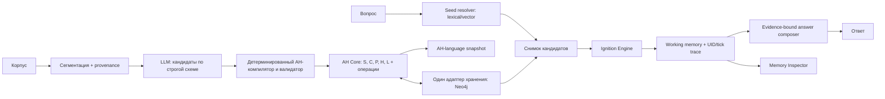

# Разбор сессии 019f8ad5-46ab-76c1-aa29-f80683d1a633

## Короткий вердикт

Сессия пришла к правильному продукту: не «ещё одному GraphRAG», а интерпретатору ассоциативно-гетерархической памяти (АГ-памяти) с проверяемым извлечением фактов, собственным движком возбуждения, рабочей памятью и объяснением ответа через UID-трассу. Финальная схема в целом жизнеспособна для хакатона.

Но между хорошей общей архитектурой и строгим формализмом Душкина осталось несколько разрывов. Самый опасный — направление распространения импульса через гиперссылку: в монографии гиперссылка передаёт возбуждение от себя к актантам, а в сессии пользовательский символ фактически должен «поднять» связанный с ним факт. Это не одно и то же. Если оставить как нарисовано, реализация либо не найдёт нужные гиперссылки, либо будет молча обходить формальную семантику в обратную сторону.

Мой итоговый совет: оставить Python, FastAPI и один Neo4j-адаптер, но сначала сделать эталонное in-memory ядро. Microsoft GraphRAG, Qdrant, FalkorDB, отдельный векторный сервис, микросервисы и универсальный редактор графа для первой версии не нужны.

## Что было сделано в сессии

Сессия прошла несколько полезных этапов:

1. Из исходного задания были извлечены обязательные контуры: LLM-парсер, точная структура `AH = <S,C,P,H,L>`, операции над памятью, восьмишаговый механизм возбуждения, сборка рабочей памяти и объяснимый ответ.
2. Был изучен рынок GraphRAG-решений: Microsoft GraphRAG, связка Qdrant + Neo4j, FalkorDB и варианты собственной визуализации.
3. После появления статьи на девять страниц агент нашёл полную монографию Р. В. Душкина «Ассоциативно-гетерархическая память. Теоретико-множественная структура и система операций», второе издание 2026 года, 78 страниц. Страница полного текста и библиографические данные доступны у автора на [ResearchGate](https://www.researchgate.net/publication/401693142_Associative_Heterarchical_Memory_Set-Theoretic_Structure_and_System_of_Operations).
4. Затем были последовательно разобраны UID, символы первого порядка, выбор БД, лицензии, визуализация, определение и реализация движка возбуждения, веса и финальная архитектура.

Такой маршрут был продуктивным: к финалу исчезли лишние компоненты, а центральным объектом стал собственный AH Core. Это правильное направление.

## Что на самом деле фиксирует монография

### 1. АГ-память — не обычный knowledge graph

Модель задаётся кортежем:

`AH = <S, C, P, H, L>`

- `S` — множество абстрактных символов первого порядка, связанных с модально-зависимыми формами `R`;
- `C` — гиперсеть общих знаний;
- `P` — гиперсеть частных знаний;
- `H` — личная история;
- `L` — направленные ассоциативные связи.

Элемент `C`, `P` или `H` содержит один из семи вариантов полезной нагрузки — ссылку на символ, ссылку на мультимодальный символ, функциональный символ, группу, шаблон или гиперссылку/факт — и динамические величины возбуждения и активации. То есть схема вида `(:Entity)-[:REL]->(:Entity)` недостаточна: тип элемента, секция памяти, ссылка как самостоятельный объект, порядок в группе, роли актантов, свойства и метаданные должны сохраняться без потерь.

Для гиперссылки `N` естественна рефикация: отдельный узел факта плюс ролевые связи к актантам. Это совпадает с общим паттерном представления n-арных отношений, описанным [W3C](https://www.w3.org/TR/swbp-n-aryRelations/).

### 2. UID — не косметика

UID нужен не только крупным узлам. Самостоятельную идентичность имеют ссылки, шаблоны, факты и связи. Это позволяет:

- ссылаться на один и тот же элемент из разных секций;
- обновлять элемент операцией без пересоздания графа;
- строить точную трассу ответа;
- сериализовать и восстанавливать память без неявного слияния;
- хранить provenance вплоть до исходного фрагмента текста.

Поэтому человеческая метка и UID должны быть разными полями. Метка меняется и может повторяться; UID является идентичностью.

### 3. Операции и язык представления — разные уровни

В работах Душкина описаны операции добавления, редактирования и извлечения, а удаление заменено сборкой мусора. Отдельно существует декларативный AH-language с файлами модели и проекта. Это два разных интерфейса:

- операции — API изменения и чтения памяти;
- AH-language — переносимый формат описания/снимка.

В архитектуре сессии DSL и операции были местами объединены в один блок. В коде лучше оставить один публичный AH Core API, а сериализацию AH-language сделать адаптером ввода-вывода.

### 4. Возбуждение — частично заданная, а не полностью готовая вычислительная модель

Монография задаёт общий цикл: собрать импульсы по ассоциативным связям и гиперссылкам, вычислить выход элемента, обновить возбуждение, применить порог, обновить веса по Хеббу и повторять такт за тактом. Условия остановки вычислительного запуска в книге нет: модель рассчитана на непрерывно функционирующего агента. Перечислены пять глобальных параметров `L, g, t, h, ν`; функция активации `f` относится к элементу. При этом обозначение `L` конфликтует с уже использованным `L` — множеством ассоциативных связей, а `g` одновременно обозначает функциональный символ и функцию затухания.

При этом формула не до конца фиксирует, как суммарный вход `z` интегрируется в следующее состояние `x`. В сессии сначала появился обычный накопительный интегратор, а позднее — правильная оговорка, что это инженерная интерпретация. Эта оговорка должна быть не примечанием, а частью контракта движка:

- режим `literal-2026` — максимально буквальное исполнение опубликованной схемы;
- режим `experimental-integrator` — явно названное расширение;
- сравнение режимов на одном наборе тестов.

### 5. Направление гиперссылки — граница двух механизмов вывода

В формализме гиперссылка `N` посылает импульс своим актантам. Но типичный запрос начинается с распознанного символа `S`: например, с названия проекта. Чтобы от символа перейти к факту запуска, нужны либо:

- явные направленные связи `L` от символа к `N`;
- отдельный этап поиска гиперссылок, где символ является актантом, до запуска нормативного возбуждения;
- или формально объявленное двунаправленное правило, которое уже будет расширением модели.

В полном тексте есть операция `findHypernodes`, которая специально возвращает гиперсвязи, где заданный символ или элемент является актантом. Поэтому это не пробел всей модели: семантический поиск может найти `N` от актанта. Но такой обратный переход не является шагом механизма возбуждения. В сессии путь вида `s-project -> N-launch` показывался так, будто он возникает сам из отношения актантности. Это нельзя оставлять неявным. Я бы выбрал второй вариант: `findHypernodes` собирает ограниченный снимок-кандидат, а движок возбуждения уже работает по точным направленным связям модели. Retrieval и ignition в таком случае не смешиваются.

### 6. Формальные несогласованности, подтверждённые полным PDF

1. Множество `L` объявлено как связи между `S,C,P,H`, но концы связи `l=<UID,ID,w,(e1*,e2*)>` на стр. 23 определены только как ссылки на элементы `C,P,H`. Для поддержки объявленных связей с `S` тип конца должен быть `s* | e*`.
2. Шаблон `T` содержит множество ролей `A`, а гиперсвязь `N` — только последовательность ссылок на заполнители. При разрешённом частичном заполнении ролей явное соответствие «роль → актант» теряется. В реализации нужна структура `RoleBinding(role_id, target_ref)` либо пустые позиции фиксированной схемы.
3. `editAbstractSymbol` и `editElement` заменяют объект по переданному UID, но не требуют совпадения UID нового объекта со старым. Без дополнительного инварианта операция может создать висячие ссылки.
4. Есть `addLink`, но нет `editLink`, хотя шаг 7 фокуса активации должен каждый такт менять веса ассоциативных связей. Для гиперсвязи можно применить `editElement`, для элемента `L` опубликованного пути обновления нет.
5. Список `k` назван упорядоченным множеством и записан через индексированное множество. Не определено, допустимы ли дубликаты и что является семантикой порядка; для реализации его следует трактовать как последовательность ссылок.
6. Утверждение, что практически любой предикат должен содержать СУБЪЕКТ и ОБЪЕКТ, непригодно как строгий инвариант: существуют непереходные, безличные и погодные конструкции. Реестр из 16 ролей следует считать стартовым словарём, а не полной межъязыковой онтологией.

## Разбор финальной архитектуры по блокам

| Блок | Что хорошо | Что исправить |
|---|---|---|
| Upload / Question UI | Два ясных пользовательских потока | Для демо достаточно одной страницы; отдельное приложение-редактор не нужно |
| Preprocess | Нужен для сегментации и provenance | Хранить `source_id`, span, hash и время загрузки; не превращать chunk в сущность АГ-памяти автоматически |
| LLM Parser | Правильное место для вероятностного извлечения | LLM выдаёт кандидатов по строгой схеме, но не мутирует память напрямую |
| AH Validator | Критически важный блок | Проверять все типы, UID, секцию, шаблон и роли, ссылки, порядок групп, конечность весов и provenance |
| AH Core | Правильный центр системы | Он должен быть единственным владельцем мутаций; «Operations» не нужен как параллельный центр |
| Neo4j | Удобен для просмотра связей и Cypher | Это адаптер хранения, не сама АГ-память; lossless round-trip обязателен |
| Seed Resolver | Нужен для сопоставления запроса и символов | Разделить lexical/vector matching и нормативное распространение возбуждения |
| Snapshot Builder | Нужен как функция | Не делать отдельным сервисом; для масштаба хакатона можно снимать весь граф или ограниченный подграф |
| Ignition Engine | Главная авторская часть решения | Два буфера состояний, детерминированный порядок тиков, явная семантика направления, ограничение тиков и численная устойчивость |
| Working Memory | Верное место для результата активации | Сохранять UID, активацию, родительский импульс, тик и источник, иначе объяснимость будет декоративной |
| Answer Composer | Полезен для естественного ответа | Модель получает только доказательства из рабочей памяти; любые внешние знания должны быть запрещены или маркированы |
| Memory Inspector | Лучший UI-акцент для жюри | Показывать ответ, исходные цитаты, UID-путь, тики и влияние параметра; универсальный редактор графа не нужен |

## Neo4j, Qdrant, FalkorDB и Microsoft GraphRAG

### Neo4j

Neo4j Community подходит как единственное постоянное хранилище прототипа: Cypher и транзакции полезны, а в актуальном Cypher доступны векторные типы и индексы. Ограничения Community — одиночный экземпляр и отсутствие части enterprise-возможностей — на хакатоне не мешают; это следует из текущей [документации Neo4j](https://neo4j.com/docs/operations-manual/current/introduction/) и [документации по векторам](https://neo4j.com/docs/cypher-manual/current/values-and-types/vector/).

Однако на Neo4j Browser как на продуктовую визуализацию лучше не рассчитывать: поставка и доступность графических инструментов зависят от варианта установки, а текущая документация отдельно отмечает, что Community Edition не включает такие инструменты в некоторых пакетах. Свой минимальный Memory Inspector надёжнее.

### Qdrant + Neo4j

Связка технически нормальна и показана в официальном [GraphRAG-примере Qdrant](https://qdrant.tech/documentation/examples/graphrag-qdrant-neo4j/), но она добавляет два источника истины, синхронизацию UID и больше отказов. При тысяче элементов отдельная векторная БД ничего не выигрывает. Добавлять Qdrant стоит только после измеренного провала встроенного индекса.

### FalkorDB

Матричное внутреннее представление FalkorDB близко по духу к разреженному движку распространения: система использует разреженные матрицы и GraphBLAS, что описано в её [архитектурной документации](https://docs.falkordb.com/design/). Но готовой семантики АГ-памяти там нет, а SSPLv1 имеет условия для публично предоставляемого сервиса, описанные в [лицензии FalkorDB](https://docs.falkordb.com/References/license.html). Миграция ради потенциальной скорости в хакатоне не окупится.

### Microsoft GraphRAG

Microsoft GraphRAG строит сущности, бинарные отношения, иерархию сообществ и сводки, а затем предлагает local/global/DRIFT-поиск; это хорошо видно в [официальной архитектуре](https://microsoft.github.io/graphrag/) и описании [DRIFT](https://microsoft.github.io/graphrag/query/drift_search/). Он полезен как источник идей для индексации и baseline, но не реализует `S,C,P,H,L`, типы АГ-памяти, её операции и динамику возбуждения. Встраивать его в основной контур — значит потратить время на адаптацию чужой онтологии и всё равно писать свой движок.

Современные работы вроде [HyperGraphRAG](https://arxiv.org/abs/2503.21322) подтверждают ценность n-арных отношений, а [HippoRAG](https://proceedings.neurips.cc/paper_files/paper/2024/file/6ddc001d07ca4f319af96a3024f6dbd1-Paper-Conference.pdf) — интерес к ассоциативной долговременной памяти. Но для хакатона это аргументы в обзоре литературы, а не зависимости проекта.

## Веса: где сессия была права и где есть риск

Правильное решение для первой версии — все структурные веса равны единице, Хеббовское обновление отключено. Это даёт проверяемый baseline.

Опасно трактовать вес гиперссылки как вероятность истинности факта. В формализме это динамическая сила передачи импульса. Надёжность источника, уверенность парсера и число подтверждений лучше хранить отдельными метаданными. Иначе один коэффициент одновременно начинает обозначать эпистемическую уверенность, частоту, важность и проводимость связи; интерпретация тиков перестаёт быть честной.

После работающего baseline можно проверить ровно одно расширение за раз:

1. фиксированные веса по типам связей;
2. затухание по времени события;
3. Хеббовское усиление успешных путей;
4. влияние confidence только на отбор кандидатов, а не на динамический вес.

Каждое расширение должно иметь ablation против режима `w=1`.

## Рекомендуемая архитектура

Важные границы:

- LLM предлагает структуру, валидатор принимает или отвергает её.
- AH Core является единственным источником истины.
- Embedding — индекс поиска, но не идентичность и не содержимое памяти.
- Snapshot immutable на время запуска.
- Движок не обращается к LLM и БД посреди тика.
- Генератор ответа не добавляет факты вне рабочей памяти.

## Как строить реализацию

### M0. Формальная совместимость

Сначала маленькая in-memory модель и один «золотой» fixture, содержащий все семь видов элементов, `S,C,P,H,L`, шаблон, n-арный факт, упорядоченную группу и ассоциативные связи. Нужны round-trip сериализация и проверки инвариантов.

Это важнее FastAPI и Neo4j: если структура искажена, все последующие метрики измеряют другую модель.

### M1. Извлечение

Сделать 8 шаблонов и минимально требуемый набор ролей из задания. Реестр ролей должен быть расширяемым данными, потому что в разных публикациях и формулировках задания встречаются разные наборы — девять, шестнадцать и более двадцати ролей. Не зашивать число в логику.

LLM возвращает source span, кандидаты UID/label, шаблон, роли, свойства и confidence. Детерминированный слой выполняет нормализацию и entity resolution.

### M2. Возбуждение и объяснимость

Сначала `w=1`, без обучения. Использовать два массива состояний — текущий и следующий — чтобы результат не зависел от порядка обхода. На каждом импульсе сохранять: источник, получатель, тип связи, вес, величину, тик. Рабочая память строится только из элементов выше порога.

Именно здесь нужно закрыть вопрос направления `S -> N`: явным `L` или предварительным поиском актантных фактов.

### M3. GC и операции

Сборка мусора удаляет элементы нулевого веса после grace-периода и подграфы без связи с `S`. До удаления обязателен dry-run со списком UID: демонстрационный корпус дороже нескольких строк кода.

### M4. Продуктовая оболочка и оценка

Одна страница: загрузка, вопрос, ответ, источники, путь и тики, один-два слайдера параметров. Затем сравнение с vanilla vector RAG на том же корпусе и той же LLM. Главное демо — новый факт, вопрос на три и более перехода, видимый tick trace и изменение результата от одного параметра.

## Что я бы убрал из текущего плана

- отдельный Qdrant;
- Microsoft GraphRAG внутри основного контура;
- FalkorDB-миграцию;
- Java/Pregel-плагин для Neo4j;
- микросервис на каждый блок;
- абстрактный repository с несколькими реализациями;
- универсальный редактор графа;
- обучение весов до появления воспроизводимого baseline.

Оставить один процесс Python, один AH Core, один Neo4j-адаптер, один движок и одну веб-страницу. Это не обедняет идею; это увеличивает вероятность успеть показать именно то, что оценивается.

## Приоритеты для хакатона

1. Без потерь представить формализм и доказать это тестом round-trip.
2. Сделать UID-трассу на 3–6 переходов — объяснимость имеет самый большой вес в оценке.
3. Обеспечить воспроизводимый tick engine до 500 мс на требуемом размере графа.
4. Показать прирост против vanilla RAG на той же модели.
5. Только потом улучшать интерфейс и веса.

Для демонстрационного домена особенно подходят журналы технических инцидентов: в них естественны роли «событие — компонент — причина — действие — результат», временные отношения и многошаговый вопрос. Учебный курс проще, но менее выразителен для причинной трассы.

## Проверка по полному PDF

После первоначального разбора был получен авторский PDF второго издания: 78 страниц, 20 рисунков, 12 разделов и 110 позиций в списке литературы. Проверены все страницы, извлечён весь текст и отдельно визуально сверены страницы с определениями структуры, операциями, восьмишаговым фокусом активации, гиперпараметрами, проблемами и направлениями развития. Указанные выше несогласованности относятся к самому PDF, а не к дефектам поискового индекса или извлечения текста.

## Итог

Финальная архитектура сессии хороша как скелет, но пока не является строгой реализацией АГ-памяти. Чтобы ею стать, ей нужны: lossless модель всех типов, явная композиция `findHypernodes` и ignition, `RoleBinding` для частично заполненных шаблонов, расширенный тип концов `L`, разделение буквального и экспериментального режима возбуждения и отделение динамических весов от доверия к фактам.

После этих поправок решение выглядит не как очередная обвязка вокруг LLM, а как самостоятельный нейросимволический механизм с проверяемой памятью и объяснимым выводом — именно это и стоит защищать на хакатоне.
