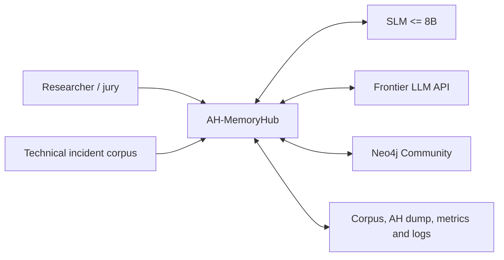
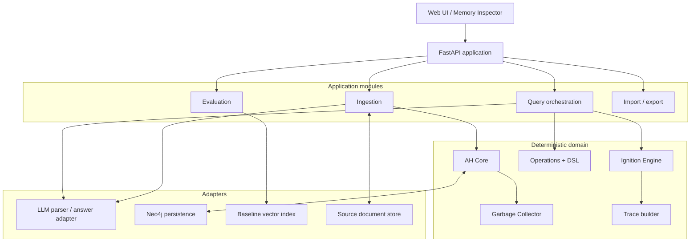
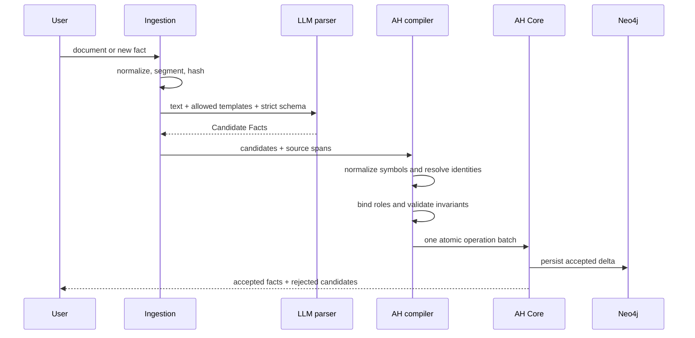

# AH-MemoryHub Architecture

Status: accepted baseline for hackathon implementation.

Normative sources:

- `docs/sources/hackathon-brief.txt` — acceptance requirements and scoring.
- `docs/sources/dushkin-ah-memory-monograph-2026.pdf` — AH-memory structure and operations.
- `CONTEXT.md` — canonical project language.

Reference domain: option B from the brief, a digital twin of an operator of a complex technical system. The domain maximises useful `CAUSE`, `FOLLOW`, `TIME`, `LOCATION`, and `TOOL` chains for the highest-weight explainability metric M2. AH Core itself remains domain-independent.

## 1. Product outcome

AH-MemoryHub is a single-user research application that:

1. accepts a text corpus and a new natural-language fact;
2. extracts typed Candidate Facts with an LLM;
3. deterministically validates and admits them to `AH = <S,C,P,H,L>`;
4. answers questions through typed lookup, graph inference, and Ignition Runs;
5. produces an answer only from Source Evidence used by the run;
6. exposes complete UID, link, tick, activation, and source traces;
7. compares the result with the same LLM backed by vanilla vector RAG.

The product is not a generic graph editor, an autonomous AGI architecture, or a wrapper over an existing GraphRAG framework.

## 2. Architectural principles

1. **The hackathon brief is the acceptance contract.** Every mandatory requirement has an implementation owner and an automated check.
2. **The monograph defines the domain; the executable profile resolves its omissions.** Deviations are explicit and testable.
3. **LLMs propose; deterministic code admits.** No model writes directly to AH Memory.
4. **AH Core owns all mutations.** Database queries and UI actions cannot bypass domain operations.
5. **Retrieval and ignition are distinct.** Retrieval selects an immutable candidate snapshot; ignition propagates only through its directed topology.
6. **Evidence precedes prose.** The answer composer receives the trace and source spans, not unrestricted corpus context.
7. **One deployable application.** Modules are code boundaries, not network services.
8. **Baseline before learning.** Uniform weights and disabled Hebbian updates are the conformance baseline.

## 3. System context



## 4. Deployable shape

The first release is a modular monolith:



There is one Python backend process and one browser frontend. Neo4j is the only server-side datastore. The baseline vector search uses the same document chunks and embeddings without introducing a second database.

## 5. Executable AH profile

The code follows the monograph's tuple and names while applying these mandatory clarifications.

### 5.1 Canonical aggregate

```text
AHMemory
  symbols: S = set[FirstOrderSymbol]
  common: C = set[MemoryElement]
  private: P = set[MemoryElement]
  history: H = set[MemoryElement]
  links: L = set[AssociativeLink]
```

Every UID is unique across its addressable type and immutable after creation. A Memory Element belongs to exactly one of `C`, `P`, or `H`.

### 5.2 Types

```text
FirstOrderSymbol = <uid, sensory_representations>
SReference       = <'S', target_uid, reference_uid>
MReference       = <'M', target_uid, reference_uid>
SecondOrderSymbol= <uid, properties, meta_properties>
FunctionalSymbol = <uid, function_id, ordered_operands>
MemoryList        = <uid, ordered_members, properties, meta_properties>
ControlTemplate   = <uid, predicate_ref, ordered_roles>
RoleBinding       = <role_id, target_ref>
Hypernode         = <uid, weight, template_ref, role_bindings, properties, meta_properties>
AssociativeLink   = <uid, type_id, weight, source_ref, target_ref>
MemoryElement     = <payload, excitation, activation_function>
```

The endpoint type of an Associative Link is `SReference | MReference`. This deliberately resolves the conflict between the declared `S,C,P,H` connectivity and the narrower `e*` notation on monograph page 23.

`RoleBinding` is explicit because the monograph allows partially filled templates while `N` otherwise stores only an unlabelled sequence of actants. Empty roles are absent bindings, not positional shifts.

### 5.3 Properties and evidence

Properties retain the monograph tuple `<name,value,type,unit>`. Names are unique within one owner. Meta-properties have the same shape but are understood by application behaviour.

Every automatically admitted Hypernode adds immutable Source Evidence:

```text
SourceEvidence
  document_uid
  chunk_uid
  start_offset
  end_offset
  exact_text
  content_hash
  parser_run_uid
  model_id
  parser_confidence
```

Parser confidence and source reliability never overwrite activation weights.

### 5.4 Structural invariants

Admission fails atomically if any invariant is violated:

- all UIDs and references resolve;
- reference kind matches its target;
- every element belongs to one section only;
- property names are unique per owner;
- values and weights are finite; weights are in `[0,1]`;
- Role Bindings use roles declared by their Control Template;
- one role is bound at most once unless the template explicitly declares multiplicity;
- Memory List order is preserved;
- IS-A subgraphs are directed acyclic graphs;
- FOLLOW subgraphs inside Episodes are directed acyclic graphs;
- automatically admitted facts contain Source Evidence;
- an edit cannot change identity or leave dangling references.

The brief's “almost mandatory SUBJECT and OBJECT” is a parser preference and evaluation target, not a universal invariant. Missing required roles are validation errors only for templates that declare them required.

## 6. Ingestion



### 6.1 LLM output contract

The parser may return only:

- predicate/template candidate;
- role bindings using the 16-role registry;
- canonical labels and observed word forms;
- event time, location, cause, tool, and other role values;
- exact source span and confidence;
- unresolved-entity flags.

It cannot assign final UIDs, choose `C/P/H` without a deterministic policy, create arbitrary link types, or execute DSL.

### 6.2 Deterministic compiler

The compiler:

1. checks source spans against the original text;
2. resolves or creates First-order and Second-order Symbols;
3. selects one of at least eight Control Templates;
4. converts role values into explicit Role Bindings;
5. assigns `C`, `P`, or `H` from a documented policy;
6. creates Source Evidence;
7. derives required IS-A, FOLLOW, and CAUSE links;
8. validates the complete delta before mutation.

The rabbit fixture from monograph section 7 remains a permanent conformance test. At least six of its eight facts must be extracted automatically.

## 7. AH operations and DSL

AH Core exposes the complete operation set required by the brief:

### Mutation operations

| Operation | Normative signature |
|---|---|
| `addAbstractSymbol` | `S × s → S` |
| `editAbstractSymbol` | `S × UID × s → S` |
| `addElement` | `(C|P|H) × e → (C|P|H)` |
| `editElement` | `(C|P|H) × UID × e → (C|P|H)` |
| `addProperty` | `(Pr|Mt) × p → (Pr|Mt)` |
| `editProperty` | `(Pr|Mt) × UID.name × p → (Pr|Mt)` |
| `addLink` | `L × l → L` |
| `editLink` | `L × UID × l → L` — executable-profile addition required by Hebbian updates |

### Retrieval operations

| Operation | Normative signature |
|---|---|
| `getAbstractSymbol` | `S × UID → s` |
| `findAbstractSymbols` | `S × {primary_symbol} → {s}` |
| `getSReference` | `X × UID → s*` |
| `findSReferences` | `X × UID → {s*}` |
| `getMReference` | `X × UID → m*` |
| `findMReferences` | `X × UID → {m*}` |
| `getSymbol` | `X × UID → m` |
| `findSymbols` | `X × {p} → {m}` |
| `getList` | `X × UID → k` |
| `findLists` | `X × e → {k}` |
| `getTemplate` | `X × UID → T` |
| `getHypernode` | `X × UID → N` |
| `findHypernodes` | `X × (s|T|e) → {N}` |
| `findRoles` | `X × role × value → {N}` |
| `getLink` | `L × UID → l` |
| `findLinks` | `L × addressable_element → {l}` |

`X` is any selected subset of `C ∪ P ∪ H`. The last two signatures use `L` explicitly even though table 3 overloads `X` in prose; this preserves the operation's stated behaviour while keeping the type system coherent. Empty lookup results are represented by a typed absence, never a fabricated domain object.

The DSL is parsed into a small typed AST and then translated into these operations. It supports calls, named arguments, pipelines, and set intersection. It does not expose Cypher.

Example:

```text
findRoles(role=LOCATION, value="compressor hall")
| intersect(findLists(type=Episode))
| follow(depth=3)
```

The interpreter is read-only by default. Mutation commands require an explicit mutation endpoint and run through the same validator as ingestion.

## 8. Query and inference

The question-answer path combines three distinct mechanisms:

1. **Seed resolution** maps query phrases to First-order or Second-order Symbols using exact forms, normalized forms, and embedding similarity.
2. **Typed retrieval** uses `findHypernodes`, `findRoles`, `findLists`, and directed link traversal to create a bounded candidate snapshot.
3. **Ignition** propagates dynamic activation through that immutable snapshot and produces Working Memory plus an Ignition Trace.

This distinction resolves the apparent reverse-hyperlink problem. `findHypernodes` may retrieve a Hypernode from an actant; ignition itself still sends a Hypernode impulse to its actants as specified on monograph page 48.

The answer composer receives only:

- Working Memory elements;
- the minimal traced subgraph actually used;
- exact Source Evidence;
- the question and requested response shape.

If the evidence cannot support an answer, the result is `insufficient_evidence`; the LLM is not allowed to complete from parametric knowledge.

## 9. Ignition Engine

### 9.1 Runtime snapshot

An Ignition Run never reads Neo4j during a tick. The Snapshot Builder compiles the candidate subgraph into:

- stable integer indices for UIDs;
- arrays for current excitation, activation, thresholds, and element type;
- compressed incoming and outgoing Associative Links;
- Hypernode-to-actant incidence lists;
- source mappings for trace reconstruction.

The engine uses current and next buffers, so results do not depend on iteration order.

### 9.2 Tick semantics

For each tick, in deterministic order:

1. compute incoming associative impulses `z_a = activation(source) * weight`;
2. compute Hypernode impulses `z_h = activation(hypernode) * weight` for each actant;
3. sum incoming impulses `z` per element;
4. compute activation output `a = f(z, x)`;
5. compute next excitation;
6. update Working Memory membership using threshold `t`;
7. update link and Hypernode weights with `h`;
8. commit next buffers and append the trace.

The monograph leaves the integration of `z` into `x` underspecified. AH-MemoryHub exposes two documented profiles:

- `literal_2026`: `x_next = g(x_current)`; used for conformance comparison.
- `integrated_v1`: `x_next = g(f(z, x_current))`; used for the working product because incoming impulses must affect subsequent state.

Both profiles use the same trace and tests. The selected profile is printed in every run and metric log.

### 9.3 Default functions and five required hyperparameters

The initial reproducible configuration is:

```text
f(z, x) = clip(z + x, 0, 1)
g(x)    = x * exp(-decay_lambda * tick_duration)
h(w, out, in) = clip(w + hebbian_eta * out * in, 0, 1)
```

Required hyperparameters:

1. `initial_life_ticks` — GC grace period;
2. `decay_lambda` — parameter of `g`;
3. `working_memory_threshold` — `t`;
4. `hebbian_eta` — parameter of `h`, initially `0` for baseline;
5. `rhythm_hz` — `ν` for periodic excitation pulses.

`max_ticks`, convergence epsilon, and snapshot size are execution safeguards, not claims of additional cognitive hyperparameters.

### 9.4 Termination

A bounded query run ends on the first of:

- `max_ticks` reached;
- no activation or excitation above epsilon and no scheduled pulse;
- Working Memory and excitation change remain below epsilon for a configured number of ticks.

Continuous perception, when implemented as a bonus, runs successive bounded windows and carries Working Memory state between them.

### 9.5 Trace

For every tick the trace records:

- source and target UID;
- link or Hypernode UID;
- impulse type and value;
- previous and next excitation;
- activation output;
- threshold entry or exit;
- previous and next weight;
- parent trace entry.

The answer trace is a minimal causal projection of these entries, not hidden model reasoning.

## 10. Garbage collection

GC is deterministic and runs only between write transactions and Ignition Runs.

An element is collectible after `initial_life_ticks` when either:

- every incident Associative Link and Hypernode contribution has zero weight; or
- it belongs to a component with no path to any First-order Symbol in `S`.

GC has `preview` and `commit` modes. It computes the complete deletion set, verifies that no retained reference points into it, then deletes atomically. Metrics record orphan count before and after, false deletions, and elapsed time.

The M3 fixture inserts 200 isolated nodes, advances 50 ticks, expects all eligible orphans removed, and verifies that every connected live node remains.

## 11. Persistence model

Neo4j is a lossless projection, not the domain model.

Suggested labels:

- `FirstOrderSymbol`
- `MemoryElement` plus one payload label
- `SReference` and `MReference`
- `ControlTemplate`
- `RoleBinding`
- `Hypernode`
- `AssociativeLink`
- `MemoryList`
- `SourceDocument`, `SourceSpan`, `ParserRun`

References, Role Bindings, and Associative Links remain first-class identified nodes when required for UID-level tracing. Convenience relationships may be projected for queries but cannot replace these canonical objects.

All writes are versioned with a monotonic memory revision. An Ignition snapshot records its source revision. Export produces a complete AH dump plus source manifests and checksum.

## 12. API boundaries

Minimum public API:

| Endpoint | Purpose |
|---|---|
| `POST /api/v1/ingestions` | Submit document or new fact |
| `GET /api/v1/ingestions/{id}` | Accepted and rejected candidates |
| `POST /api/v1/queries` | Run question → retrieval → ignition → answer |
| `GET /api/v1/ignition-runs/{id}` | Run metadata and result |
| `GET /api/v1/ignition-runs/{id}/ticks` | Tick trace |
| `POST /api/v1/dsl/query` | Execute read-only composed DSL |
| `POST /api/v1/dsl/mutate` | Execute validated mutation DSL |
| `POST /api/v1/gc/preview` | List collectible UIDs |
| `POST /api/v1/gc/commit` | Apply exact previewed deletion set |
| `GET /api/v1/memory/stats` | Cardinalities and invariants |
| `POST /api/v1/memory/export` | Produce AH dump |
| `POST /api/v1/evaluations` | Run M1–M5 evaluation suite |

Organiser-created nodes and links use the same mutation surface; no private maintenance API bypasses invariants.

## 13. Evaluation architecture

### M1 — role extraction

A labelled corpus stores expected template and Role Bindings. Evaluation computes per-role precision, recall, F1, and the required weighted F1. SUBJECT and OBJECT receive weight 2; LOCATION is always included.

### M2 — explainable depth

Each test question declares the expected answer and a gold UID/link path of depth 1–6 over FOLLOW, IS-A, or CAUSE. A result scores only when the answer is correct and the produced trace contains the complete used path.

### M3 — garbage collection

The fixed orphan fixture measures efficiency and false deletion count after 50 ticks.

### M4 — vanilla RAG baseline

The baseline uses the same corpus, chunking, embedding model, and answer LLM. It receives top-k text chunks only. Logs retain retrieved chunks so hallucination and explainability deltas can be reproduced.

### M5 — model-class robustness

The identical extraction schema and deterministic compiler are run with one local SLM of at most 8B parameters and one frontier model. Results are stored per model and compared with the brief's RobustnessGain formula.

## 14. Hackathon compliance matrix

| Requirement | Owner | Proof |
|---|---|---|
| Exact `AH=<S,C,P,H,L>` and all element types | AH Core | Full-type fixture and round-trip test |
| Non-empty, modality-labelled `R` | Symbol validator | ≥150-symbol audit |
| Complete operation list | Operations module | Signature and behaviour tests |
| IS-A DAG | Hierarchy validator | Cycle rejection test |
| FOLLOW DAG episode | Episode validator | Cycle rejection test |
| Rabbit fixture | Conformance suite | Manual exact fixture + automatic ≥6/8 extraction |
| ≥8 templates and ≥6 required roles | Template registry | Registry audit |
| LLM → deterministic transform → `N` | Ingestion | Recorded parser and compiler run |
| `findRoles` | Operations | Role query tests |
| Syntactic QA | Query | Rabbit QA tests |
| Eight-step ignition | Ignition Engine | Per-step trace assertions |
| Five hyperparameters | Run configuration | Config dump and live parameter demo |
| GC and initial life | Garbage Collector | M3 fixture |
| Composable DSL | DSL | Pipeline/intersection tests |
| Concrete ↔ abstract activation | Snapshot topology + `L` | Dog-style propagation fixture |
| Excitation loops | Ignition Engine | Stable-context fixture |
| ≥1000 nodes/links from ≥15k words | Ingestion + corpus | Build audit after GC |
| Tick ≤500 ms at N=1000 | Benchmark | p50/p95 tick log |
| M1–M5 | Evaluation | Machine-readable metrics report |
| New live fact | Ingestion API/UI | Defence script |
| ≥3-hop question and UID tick trace | Query/UI | Defence script |
| Parameter influence | Ignition/UI | A/B run in defence script |
| Code, note, corpus, dump, logs, demo | Release task | Release manifest |

## 15. Test layers

1. **Conformance:** exact types, operations, invariants, rabbit fixture.
2. **Domain:** compiler policies, Role Bindings, hierarchy and episode rules.
3. **Engine:** deterministic ticks, directionality, profiles, threshold, decay, Hebbian clipping.
4. **Persistence:** AH Core → Neo4j → AH Core equality.
5. **Application:** ingestion and query vertical slices with fake LLM responses.
6. **Evaluation:** M1–M5 formulas on frozen fixtures.
7. **Performance:** N=1000 tick benchmark with trace enabled.
8. **Demo smoke:** start clean, ingest a new fact, ask a 3-hop question, inspect the trace, change one parameter.

## 16. Delivery order

1. AH Core, glossary, executable profile, and conformance fixture.
2. Complete operations and DSL AST.
3. Snapshot compiler and Ignition Engine with traces.
4. GC and M3 fixture.
5. Eight templates, deterministic compiler, rabbit auto-extraction.
6. Query orchestration and evidence-bound answers.
7. Neo4j projection and AH export.
8. Technical-incident corpus and M1/M2 gold sets.
9. Vanilla RAG baseline and M4/M5 runners.
10. Memory Inspector UI and defence script.

The first demonstrable milestone is not a polished empty interface. It is a CLI/API run over the rabbit fixture that proves the data model, operations, ignition, working memory, and UID trace end to end.
